# Blazor_Auth

## 목차

1. [프로젝트 개요](#프로젝트-개요)
2. [경로 별 Layout 설정](#경로-별-layout-설정)
3. [토큰 인증 방식](#토큰-인증-방식)
4. [JwtBearer 설치](#jwtbearer-설치)
5. [JwtBearer 인증 옵션 적용하기](#인증-옵션-적용하기)
6. [엔드포인트에 인증 적용하기](#엔드포인트에-인증-적용하기)
7. [커스텀 인증 핸들러](#커스텀-인증-핸들러)
8. [페이지 진입 시 세션 체크 일괄 적용하기](#페이지-진입-시-세션-체크-일괄-적용하기)

---

## 프로젝트 개요

이 프로젝트는 [Blazor_Study](https://github.com/sueshinkr/Blazor_Study) 레포지터리의 내용을 기반으로 로그인 및 세션 관리 기능을 추가한 것이다. 변경사항 요약은 다음과 같다.

### 1. 로그인 기능 추가

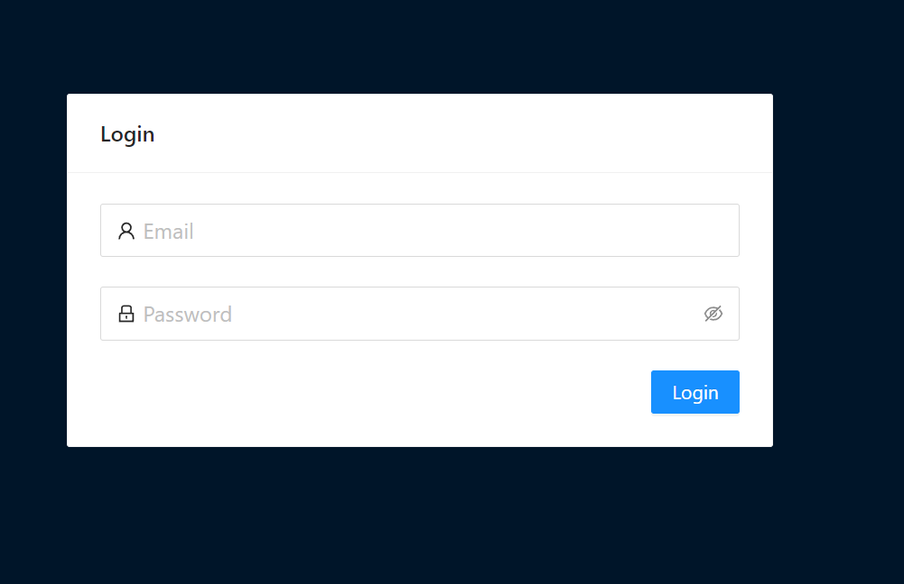

Base Url에 접근시 최초에는 로그인 화면만 나타난다.
로그인하지 않으면 다른 메뉴들을 볼 수 없고, 주소창에 직접 URL을 입력해도 이동되지 않는다.

### 2. 세션 만료시 접근 불가

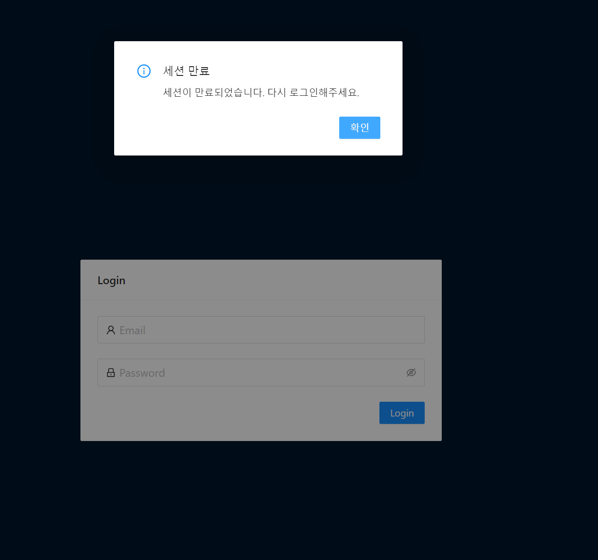

이 프로젝트에서는 Session Storage에 JWT 기반 Access Token, Refresh Token을 저장하고, 이것으로 Managing API를 호출한다. Session Storage에 저장된 토큰이 만료되거나 오염된 경우 토큰이 삭제되고 재로그인을 유도한다.

### 3. 경로 별 Layout 설정

- 기존 메뉴
  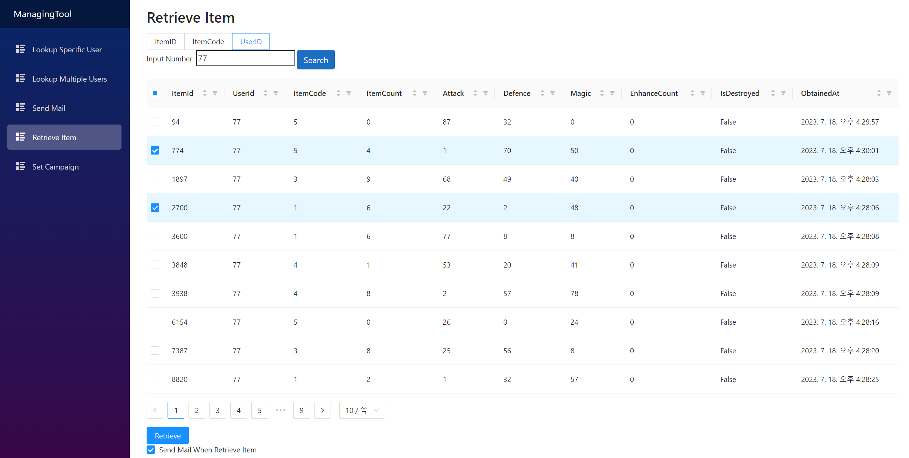

- 변경 후 메뉴
  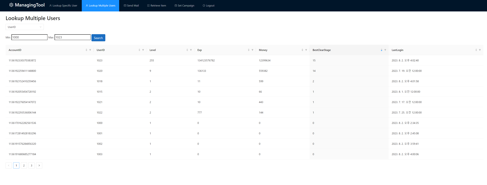

경로 별 Layout을 다르게 적용했고, 메뉴 바(네비게이션 바)가 상단에 수평 형태로 위치하도록 변경했다.

<br>

---

## 경로에 따른 Layout 설정

| 메인 화면                       | 로그인 이후 화면                |
| ------------------------------- | ------------------------------- |
| 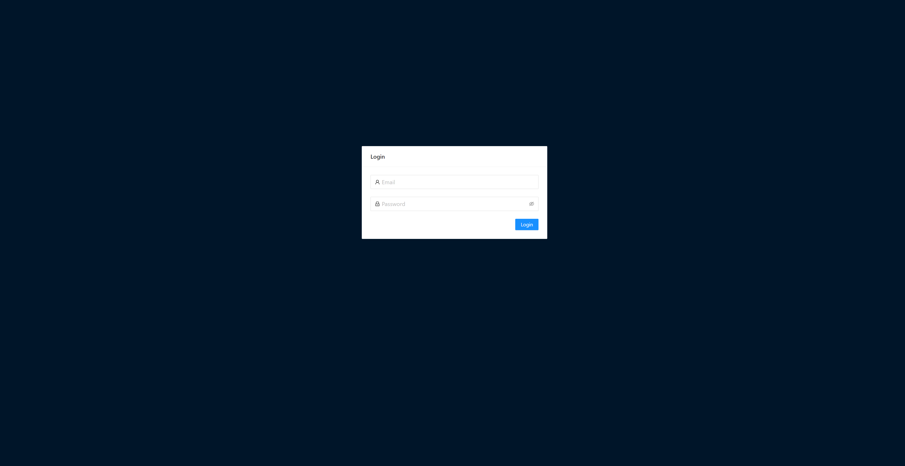 |  |

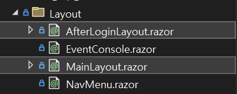

이 프로젝트에서는 라우팅에 따라 다른 **Layout**을 사용하고 있다. 사용하는 레이아웃은 각각 **MainLayout**, **AfterLoginLayout** 이다.

Blazor에서 라우팅은 **App.razor** 파일에서 설정 가능하다. App.razor에서 NavigationManager를 주입받고, 경로에 따라 `@if-else` 문을 사용해 레이아웃을 세팅해준다.<br/>
이 프로젝트는 초기 페이지(`NavigationManager.BaseUri`)를 제외하고는 모두 AfterLoginLayout을 적용하게 했다.

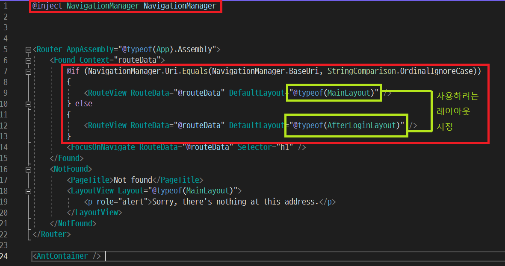

### 레이아웃 예시 코드

1. MainLayout (로그인 화면)

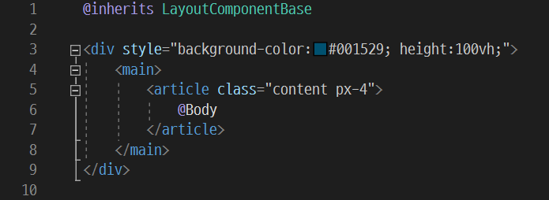

2. AfterLoginLayout (로그인 이후 화면)

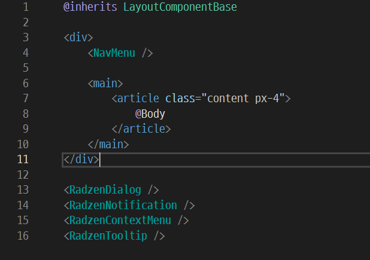

메뉴 바(네비게이션 바) `NavMenu` 컴포넌트를 기본적으로 포함하고 있는 형태의 레이아웃이다.<br/>
메뉴 바는 AntDesign 라이브러리에서 제공하는 것을 사용해 만들었으며, 예시 코드는 다음과 같다.

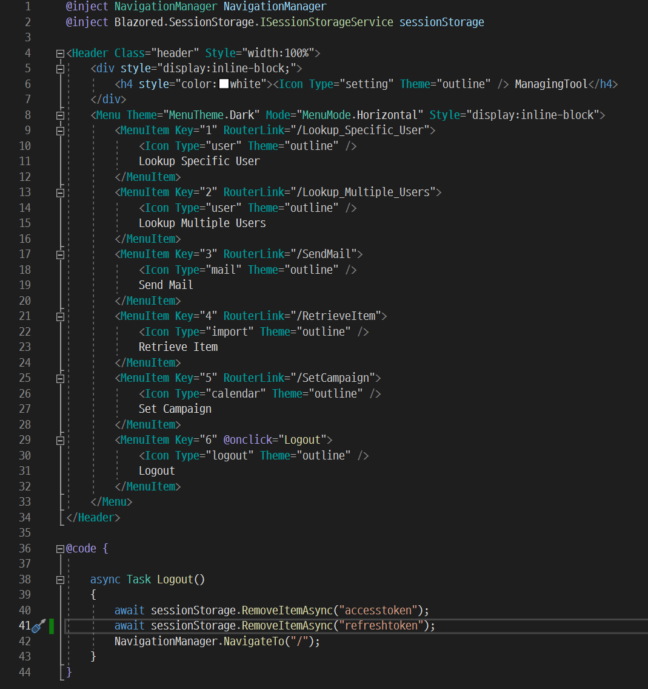

<br>

---

## 토큰 인증 방식

### 최초 로그인

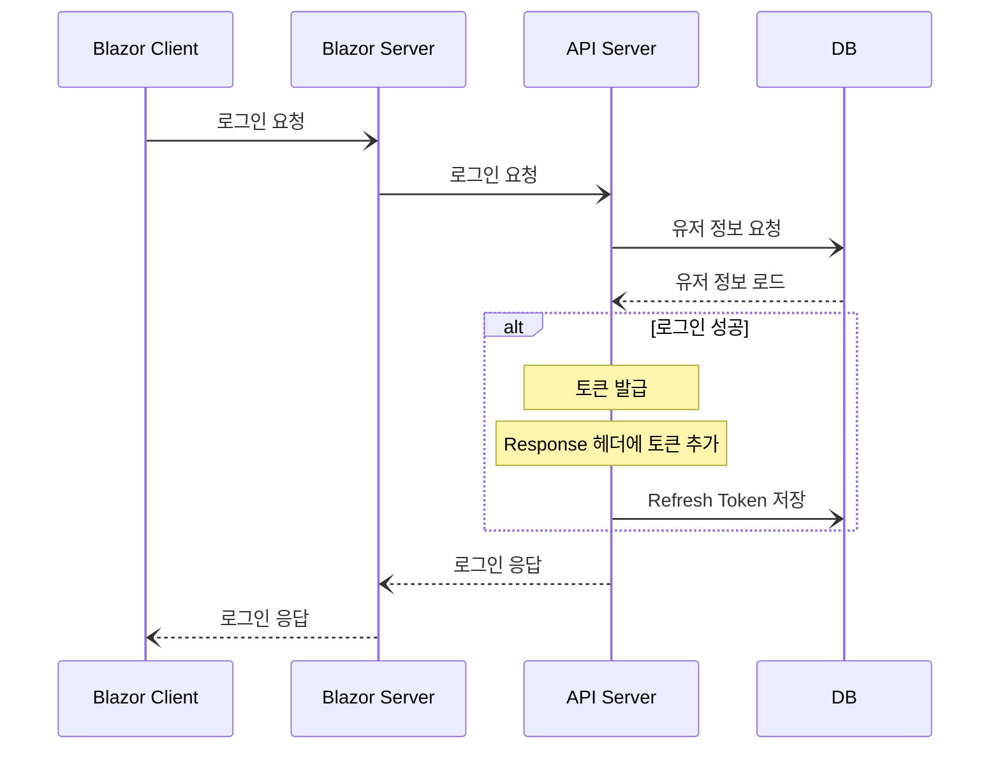

최초 로그인 성공 시 Access Token, Refresh Token을 발급해 응답 헤더에 추가해 전송한다.

### 토큰 발급 이후 API 호출

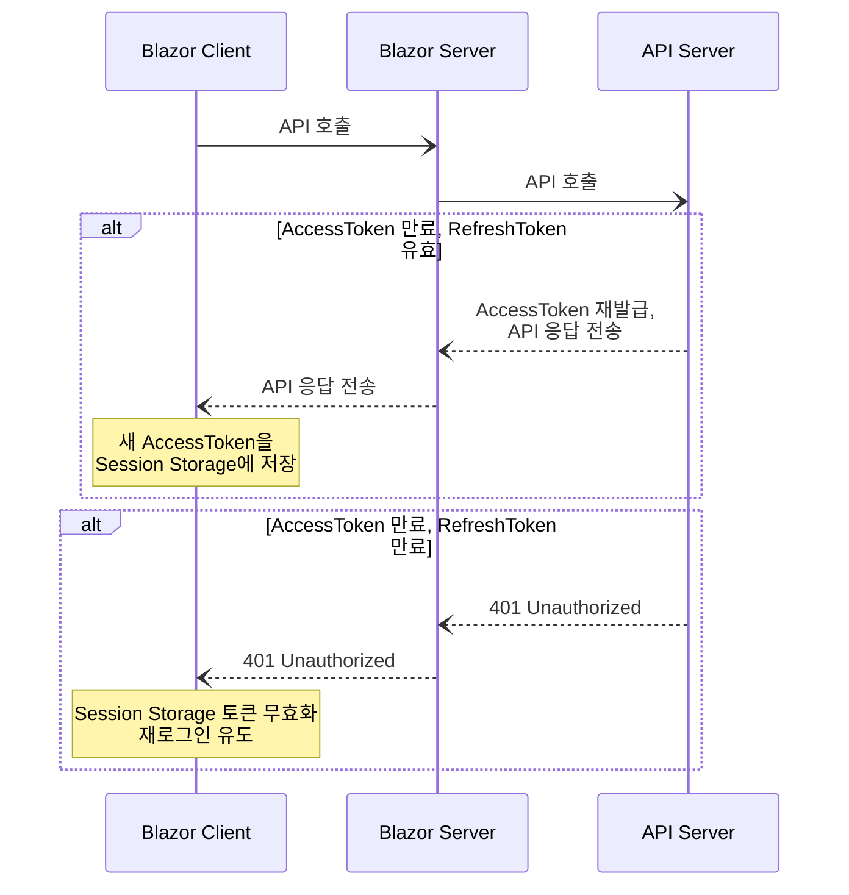

Managing API 호출 시 토큰을 사용한다. (클라이언트는 항상 헤더에 두 토큰을 모두 추가해서 전송한다.)

Access Token이 만료되어도 Refresh Token이 유효하다면 새 Access Token을 발급해준다. Refresh Token도 만료되었다면 다시 로그인을 시도해야 한다.

### AccessToken 재발급 로직

1. Refresh Token을 가져와 기한이 만료되었는지 확인한다.
2. Refresh Token의 Claim에 담겨있는 `AccountId`를 가져온다.
3. DB에서 `AccountId`가 일치하는 레코드를 찾아 `RefreshToken` 컬럼이 헤더의 Refresh Token과 같은지 비교한다.
4. 같다면 새 Access Token을 발급해 응답 헤더에 추가하고, API 요청을 이어서 수행한다.

<br>

---

## JwtBearer 적용

### 설치

|                                 |                                 |
| ------------------------------- | ------------------------------- |
|  | 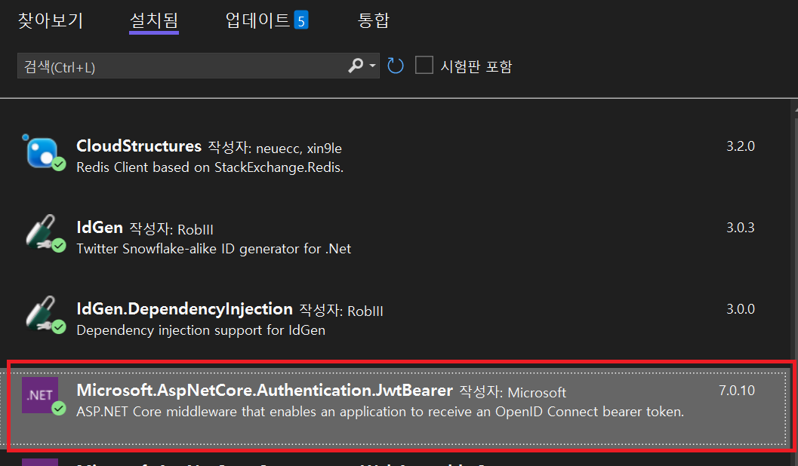 |

Blazor Server, API Server 프로젝트에 Nuget 패키지 관리자 -> 솔루션용 NuGet 패키지 관리에서 `Microsoft.AspNetCore.Authentication.JwtBearer` 를 설치한다.

<br>

---

## 인증 옵션 적용하기

### Program.cs에 JwtBearer 추가

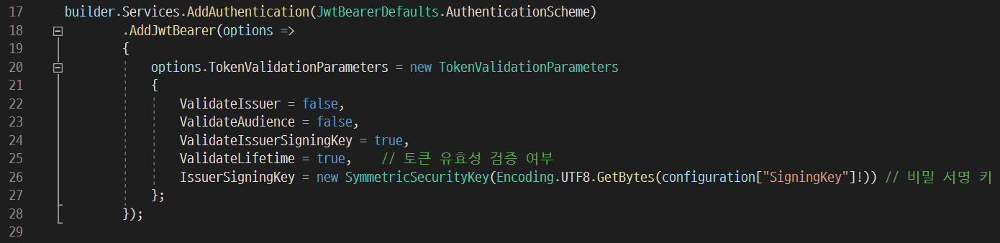

`Program.cs` 에서, `AddAuthentication`으로 `JwtBearer`를 추가하고 토큰 검증에 필요한 옵션들을 작성한다.

옵션은 아래와 같은 것들이 있으며, 더 많은 옵션은 참고 문서에서 확인할 수 있다.

| 옵션                     | 설명                                       |
| ------------------------ | ------------------------------------------ |
| ValidateIssuer           | Issuer(토큰 발행자)에 대한 검증 여부       |
| ValidateAudience         | Audience(토큰 대상자)에 대한 검증 여부     |
| ValidateIssuerSigningKey | Signing Key(비밀 서명 키)에 대한 검증 여부 |
| ValidateLifetime         | 만료 기간에 대한 검증 여부                 |
| IssuerSigningKey         | 비밀 서명키 문자열                         |

[참고 문서 : MSDN TokenValidationParameters](https://learn.microsoft.com/en-us/dotnet/api/microsoft.identitymodel.tokens.tokenvalidationparameters?view=msal-web-dotnet-latest)

<br>

---

## 엔드포인트에 인증 적용하기

### Program.cs에서 Authtentication, Authorization 설정 변경

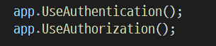

Program.cs에서 `UseAuthentication()`, `UseAuthorization()` 호출 후 엔드포인트에 `[Authorize]` 어트리뷰트를 추가하면, 앞서 설정한 토큰 인증이 수행된다.

다음은 컨트롤러 액션에 `[Authorize]` 어트리뷰트를 적용한 간단한 예시이다.

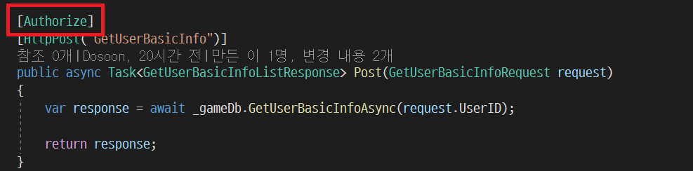

<br>

---

## 커스텀 인증 핸들러

### JwtBearerEvents

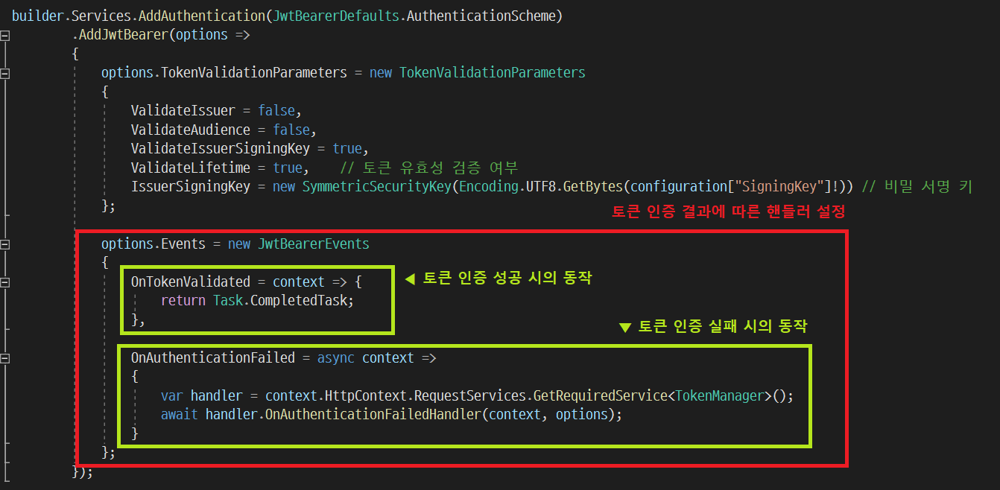

JwtBearer를 추가할 때, `options.Events`에 새로운 `JwtBearerEvents`을 생성할 수 있다. 이를 활용해 람다식 형태로 커스텀 핸들러를 지정할 수 있다.

[참고 문서 : MSDN JwtBearerEvents](https://learn.microsoft.com/en-us/dotnet/api/microsoft.aspnetcore.authentication.jwtbearer.jwtbearerevents?view=aspnetcore-7.0)

### 커스텀 핸들러를 사용한 Access Token 재발급 예시 코드

```csharp
public async Task OnAuthenticationFailedHandler(AuthenticationFailedContext context, JwtBearerOptions options)
{
    if (context.Exception.GetType() == typeof(SecurityTokenExpiredException))
    {
        // 리프레시 토큰 가져오기
        var refreshToken = context.Request.Headers["refresh_token"].FirstOrDefault();
        if (refreshToken == null)
        {
            context.Response.StatusCode = 401; // Unauthorized
            return;
        }

        try
        {
            new JwtSecurityTokenHandler().ValidateToken(refreshToken, options.TokenValidationParameters,
                                                        out var validatedToken);

            // 리프레시 토큰의 만료 시간 확인
            if (validatedToken.ValidTo < DateTime.UtcNow)
            {
                context.Response.StatusCode = 401; // Unauthorized
                return;
            }
        }
        catch
        {
            context.Response.StatusCode = 401; // Unauthorized
            return;
        }

        // 리프레시 토큰에서 AccountId 가져오기
        var accountId = TokenManager.GetClaim(refreshToken);
        if (accountId == 0)
        {
            context.Response.StatusCode = 401; // Unauthorized
            return;
        }

        // DB의 RefreshToken과 비교
        var managingDb = context.HttpContext.RequestServices.GetRequiredService<IManagingDb>();
        var DBRefreshToken = await managingDb.GetRefreshTokenByAccountId(accountId);
        if (DBRefreshToken != refreshToken)
        {
            context.Response.StatusCode = 401; // Unauthorized
            return;
        }

        // 새 액세스 토큰 발급 및 응답 헤더에 추가
        string newAccessToken = TokenManager.CreateToken(true, accountId);
        context.Response.Headers.Add("X-NEW-ACCESS-TOKEN", newAccessToken);

        // 요청을 정상 수행하도록 ClaimsPrincipal을 지정하여 Success() 처리
        ClaimsIdentity claims = new ClaimsIdentity(new[]
                    {
                        new Claim("AccountId", accountId.ToString()),
                    }, JwtBearerDefaults.AuthenticationScheme);

        context.Principal = new ClaimsPrincipal(new ClaimsIdentity[] { claims });
        context.Success();
    }
}
```

<br>

---

## 페이지 진입 시 세션 체크 일괄 적용하기

이 프로젝트에서는 페이지의 `OnInitializedAsync` 단계에서 토큰을 검사하는 `AuthPage`를 생성했다.<br>
그리고 인증이 필요한 모든 페이지에 `AuthPage`를 상속시켜 모든 페이지에서 세션 체크를 진행하도록 하고 있다.

### AuthPage.razor 예시 코드

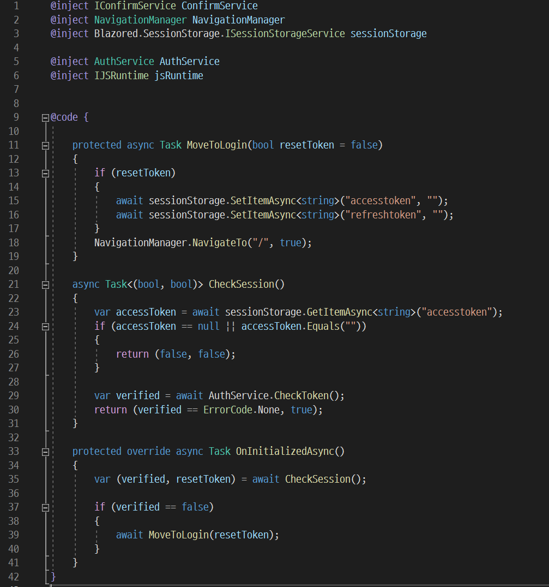

별도의 View는 존재하지 않고, `@code` 영역만 정의되어 있다.

페이지가 렌더링되기 전에 호출되는 `OnInitializedAsync` 에서 세션을 체크하고, 토큰이 유효하지 않다면 Session Storage의 토큰을 무효화한 후 로그인 페이지로 다시 이동하도록 구현했다.

### 상속받은 페이지에서의 사용 예시

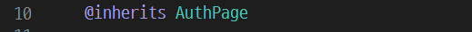

코드 최상단에 `@inherits` 를 사용해 `AuthPage`를 상속받게 한다.

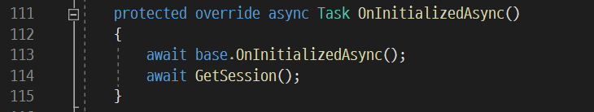

상속받은 페이지에서 `OnInitializedAsync`를 추가 작성해야 한다면, 먼저 `base`의 `OnInitializedAsync`를 호출한 후 진행해야 한다.
