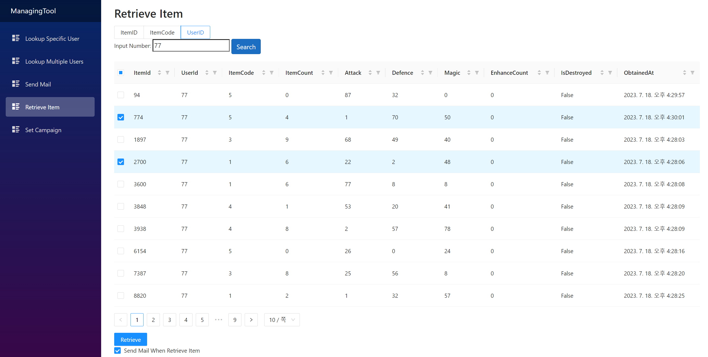
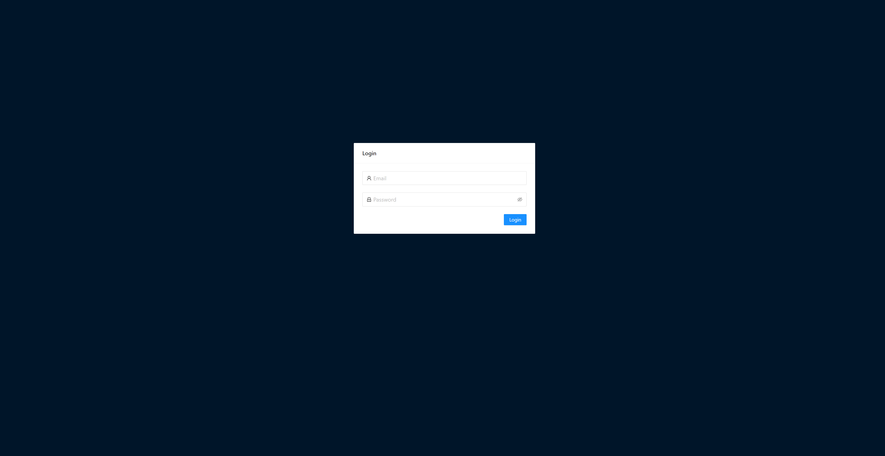
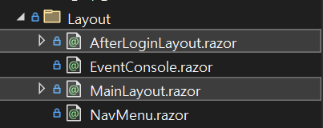
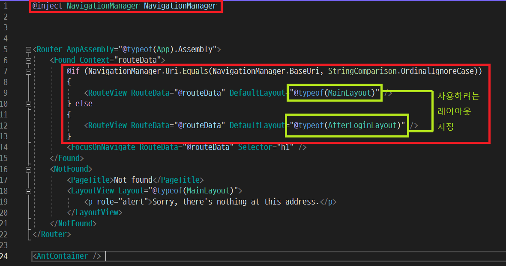

# Blazor_Auth

## 목차

1. [프로젝트 개요](#프로젝트-개요)
2. [경로 별 Layout 설정](#3-경로-별-layout-설정)
3. [토큰 인증 방식](#토큰-인증-방식)
4. Server `(Backend)`
   1. [JwtBearer 설치](#jwtbearer-설치)
   2. [토큰 발급](#토큰-발급)
   3. [토큰에서 Claim 추출](#토큰에서-claim-추출)
   4. [JwtBearer 인증 옵션 설정](#jwtbearer-인증-옵션-설정)
   5. [커스텀 인증 핸들러](#커스텀-인증-핸들러)
   6. [엔드포인트에 인증 적용](#엔드포인트에-인증-적용)
5. Client `(Frontend)`
   1. [페이지 상속](#페이지-상속)
   2. [세션 스토리지로 토큰 관리하기](#세션-스토리지로-토큰-관리하기)
   3. [요청 헤더에 토큰 추가](#요청-헤더에-토큰-추가)
   4. [응답 헤더에서 재발급 토큰 로드](#응답-헤더에서-재발급-토큰-로드)

---

## 프로젝트 개요

이 프로젝트는 [Blazor_Study](https://github.com/sueshinkr/Blazor_Study) 레포지터리의 내용을 기반으로 로그인 및 세션 관리 기능을 추가한 것이다. 변경사항 요약은 다음과 같다.

### 1. 로그인 기능 추가


Base Url에 접근시 최초에는 로그인 화면만 나타난다.<br>
로그인하지 않으면 다른 메뉴들을 볼 수 없고, 주소창에 직접 URL을 입력해도 이동되지 않는다.

### 2. 세션 만료시 접근 불가


이 프로젝트에서는 Session Storage에 JWT 기반 Access Token, Refresh Token을 저장하고,<br>
이것으로 Managing API를 호출한다.

Session Storage에 저장된 토큰이 만료되거나 오염된 경우 토큰이 삭제되고 재로그인을 유도한다.

### 3. 경로 별 Layout 설정

- 기존 메뉴
  

- 변경 후 메뉴
  

경로 별 Layout을 다르게 적용했고, 메뉴 바(네비게이션 바)가 상단에 수평 형태로 위치하도록 변경했다.

<br>

---

## 경로에 따른 Layout 설정

| 메인 화면                       | 로그인 이후 화면                |
| ------------------------------- | ------------------------------- |
|  |  |



이 프로젝트에서는 라우팅에 따라 다른 **Layout**을 사용하고 있다.<br>
(사용하는 레이아웃은 각각 **MainLayout**, **AfterLoginLayout** 이다.)

### App.razor 라우팅 설정

Blazor에서 라우팅은 **App.razor** 파일에서 설정 가능하다.<br>
App.razor에서 NavigationManager를 주입받고, 경로에 따라 `@if-else` 문을 사용해 레이아웃을 세팅해준다.<br/>
이 프로젝트는 초기 페이지(`NavigationManager.BaseUri`)를 제외하고는 모두 AfterLoginLayout을 적용시켰다.



<br>

---

## 토큰 인증 방식

### 최초 로그인

```mermaid
sequenceDiagram

Blazor Client-)Managing Server: 로그인 요청
Managing Server-)Game API Server: 로그인 요청
Game API Server-)DB: 유저 정보 요청
DB--)Game API Server: 유저 정보 로드

alt 로그인 성공
Note over Game API Server : 토큰 발급
Note over Game API Server : Response 헤더에 토큰 추가
Game API Server-)DB: Refresh Token 저장
end

Game API Server--)Managing Server: 로그인 응답

Managing Server--)Blazor Client: 로그인 응답
```

최초 로그인 성공 시 Access Token, Refresh Token을 발급해 응답 헤더에 추가해 전송한다.

### 토큰 발급 이후 API 호출

```mermaid
sequenceDiagram
Blazor Client-)Managing Server: API 호출
Managing Server-)Game API Server: API 호출
alt AccessToken 만료, RefreshToken 유효
Game API Server--)Managing Server: AccessToken 재발급,<br>API 응답 전송
Managing Server--)Blazor Client: API 응답 전송
Note over Blazor Client : 새 AccessToken을<br>Session Storage에 저장
end
alt AccessToken 만료, RefreshToken 만료
Game API Server--)Managing Server: 401 Unauthorized
Managing Server--)Blazor Client: 401 Unauthorized
Note over Blazor Client : Session Storage 토큰 무효화<br>재로그인 유도
end
```

Managing API 호출 시 토큰을 사용한다.<br>
**(클라이언트는 항상 헤더에 두 토큰을 모두 추가해서 전송한다.)**

Access Token이 만료되어도 Refresh Token이 유효하다면 새 Access Token을 발급해준다.<br>
Refresh Token도 만료되었다면 다시 로그인을 시도해야 한다.

### AccessToken 재발급 로직

1. Refresh Token을 가져와 기한이 만료되었는지 확인한다.
2. Refresh Token의 Claim에서 `AccountId`를 가져온다.
3. DB에서 `AccountId`로 유저를 찾고, **DB의 `RefreshToken`이 헤더의 Refresh Token과 같은지** 비교한다.
4. 같다면 새 Access Token을 발급해 응답 헤더에 추가하고, API 요청을 이어서 수행한다.

<br>

---

# Server (Backend)

## JwtBearer 설치

### 설치

|                                 |                                 |
| ------------------------------- | ------------------------------- |
|  |  |

Blazor Server, API Server 프로젝트에 Nuget 패키지 관리자 -> 솔루션용 NuGet 패키지 관리에서 `Microsoft.AspNetCore.Authentication.JwtBearer` 를 설치한다.

<br>

---

## 토큰 발급

JWT은 헤더(Header), 페이로드(Payload), 서명(Signature)의 3가지 파트로 나눠져 있다.<br>


- **헤더** : 어떤 알고리즘을 사용해 암호화 되었는지, 어떤 토큰을 사용하는지에 대한 정보
- **페이로드** : 전달하려는 정보 (단, 노출될 수 있음)
- **서명** : 검증을 위해 서버가 지정한 Signing Key

여기서, Payload에 담는 정보를 클레임(`Claim`)이라고 한다.

토큰은 `JwtSecurityTokenHandler`와 `SecurityTokenDescriptor`를 통해 발급할 수 있다.<br>

- `JwtSecurityTokenHandler` : 토큰 생성 및 검증 클래스
- `SecurityTokenDescriptor` : 토큰에 들어갈 정보를 담은 구조체

### 예시 코드

```csharp
// JwtSecurityTokenHandler 생성
var tokenHandler = new JwtSecurityTokenHandler();

// Signing Key, 토큰 만료 기간 설정
var key = Encoding.ASCII.GetBytes(_signingKey);
var expires = DateTime.UtcNow.AddHours(6);

// 토큰 구조체 생성
var tokenDescriptor = new SecurityTokenDescriptor
{
    Subject = new ClaimsIdentity(new Claim[]
    {
        new Claim("Key", Value),
        // ... 그 외 클레임 추가
    }),
    Expires = expires,
    SigningCredentials = new SigningCredentials(new SymmetricSecurityKey(key), SecurityAlgorithms.HmacSha256Signature)
};

// 토큰 생성
var token = tokenHandler.CreateToken(tokenDescriptor);
tokenHandler.WriteToken(token);
```

<br>

---

## 토큰에서 Claim 추출

토큰에서 Claim을 추출할 때에도 `JwtSecurityTokenHandler`를 사용한다.

```csharp
var handler = new JwtSecurityTokenHandler();
var readToken = handler.ReadJwtToken(token);

// Claim 추출
var claim = refreshToken.Claims.FirstOrDefault(claim => claim.Type.Equals("Key"));
return claim.Value;
```

### 예시 코드

토큰 페이로드에 `AccountId`라는 Key를 갖는 Claim을 추가했다면, 다음과 같이 사용할 수 있다.

`var accountIdClaim = refreshToken.Claims.FirstOrDefault(claim => claim.Type.Equals("AccountId"));`

<br>

---

## JwtBearer 인증 옵션 설정

```csharp
// Program.cs
builder.Services.AddAuthentication(JwtBearerDefaults.AuthenticationScheme)
        .AddJwtBearer(options =>
        {
            options.TokenValidationParameters = new TokenValidationParameters
            {
                ValidateIssuer = false,                                       // Issuer 검증 여부
                ValidateAudience = false,                                     // Audience 검증 여부
                ValidateIssuerSigningKey = true,                              // 비밀 서명 키 검증 여부
                ValidateLifetime = true,                                      // 토큰 유효성 검증 여부
                IssuerSigningKey = new SymmetricSecurityKey
                                       (Encoding.UTF8.GetBytes("SigningKey")) // 비밀 서명 키
            };
        });
```

Program.cs에서, `AddAuthentication`으로 `JwtBearer`를 추가하고 토큰 검증에 필요한 옵션들을 작성한다.

옵션은 아래와 같은 것들이 있으며, 더 많은 옵션은 참고 문서에서 확인할 수 있다.

| 옵션                     | 설명                                       |
| ------------------------ | ------------------------------------------ |
| ValidateIssuer           | Issuer(토큰 발행자)에 대한 검증 여부       |
| ValidateAudience         | Audience(토큰 대상자)에 대한 검증 여부     |
| ValidateIssuerSigningKey | Signing Key(비밀 서명 키)에 대한 검증 여부 |
| ValidateLifetime         | 만료 기간에 대한 검증 여부                 |
| IssuerSigningKey         | 비밀 서명키 문자열                         |

[참고 문서 : MSDN TokenValidationParameters](https://learn.microsoft.com/en-us/dotnet/api/microsoft.identitymodel.tokens.tokenvalidationparameters?view=msal-web-dotnet-latest)

<br>

---

## 커스텀 인증 핸들러

### JwtBearerEvents

Program.cs에서 JwtBearer를 추가할 때, `options.Events`를 정의할 수 있다.<br>
인증 성공, 인증 실패 등의 상황에 따라 람다식 형태로 커스텀 핸들러를 지정해 사용한다.

```csharp
// Program.cs
builder.Services.AddAuthentication(JwtBearerDefaults.AuthenticationScheme)
        .AddJwtBearer(options =>
        {
            // JwtBearer를 사용한 Authentication 이벤트에 대한 핸들러 정의
            options.Events = new JwtBearerEvents
            {
                OnTokenValidated = context => {
                    // 검증 성공 시의 동작
                },

                OnAuthenticationFailed = context =>
                {
                    // 검증 실패 시의 동작
                }
            };
        });
```

[참고 문서 : MSDN JwtBearerEvents](https://learn.microsoft.com/en-us/dotnet/api/microsoft.aspnetcore.authentication.jwtbearer.jwtbearerevents?view=aspnetcore-7.0)

### 예시 코드

이 프로젝트에서는 `OnAuthenticationFailed`에 대한 커스텀 핸들러를 사용하고 있다.<br>
예시 코드는 아래와 같으며, 실패 시에 Access Token을 재발급하는 코드이다.

```csharp
public async Task OnAuthenticationFailedHandler(AuthenticationFailedContext context, JwtBearerOptions options)
{
    // 토큰의 유효기간이 만료되어 실패한 경우
    if (context.Exception.GetType() == typeof(SecurityTokenExpiredException))
    {
        // 리프레시 토큰 가져오기
        GetRefreshToken(context);

        try
        {
            new JwtSecurityTokenHandler().ValidateToken(refreshToken, options.TokenValidationParameters,
                                                        out var validatedToken);

            // 리프레시 토큰의 만료 시간 확인
            if (validatedToken.ValidTo < DateTime.UtcNow)
            {
                context.Response.StatusCode = 401; // Unauthorized
                return;
            }
        }
        catch
        {
            context.Response.StatusCode = 401; // Unauthorized
            return;
        }

        // 리프레시 토큰에서 AccountId 가져오기
        var accountId = TokenManager.GetClaim(refreshToken);
        if (accountId == 0)
        {
            context.Response.StatusCode = 401; // Unauthorized
            return;
        }

        // DB의 RefreshToken과 비교
        var managingDb = context.HttpContext.RequestServices.GetRequiredService<IManagingDb>();
        var DBRefreshToken = await managingDb.GetRefreshTokenByAccountId(accountId);
        if (DBRefreshToken != refreshToken)
        {
            context.Response.StatusCode = 401; // Unauthorized
            return;
        }

        // 새 액세스 토큰 발급 및 응답 헤더에 추가
        string newAccessToken = TokenManager.CreateToken(true, accountId);
        context.Response.Headers.Add("X-NEW-ACCESS-TOKEN", newAccessToken);

        // 요청을 정상 수행하도록 ClaimsPrincipal을 설정하여 Success() 처리
        ClaimsIdentity claims = new ClaimsIdentity(new[]
                    {
                        new Claim("AccountId", accountId.ToString()),
                    }, JwtBearerDefaults.AuthenticationScheme);

        context.Principal = new ClaimsPrincipal(new ClaimsIdentity[] { claims });
        context.Success();
    }
}
```

<br>

---

## 엔드포인트에 인증 적용

```csharp
// Program.cs
app.UseAuthentication();
app.UseAuthorization();
```

Program.cs에서 `UseAuthentication()`, `UseAuthorization()` 호출 후<br>
**엔드포인트에 `[Authorize]` 어트리뷰트를 추가**하면, 앞서 설정한 토큰 인증이 수행된다.

다음은 컨트롤러 액션에 `[Authorize]` 어트리뷰트를 적용한 예시이다.


<br>

---

# Client (Frontend)

## 페이지 상속

**페이지 상속**을 통해 모든 Pages에 일괄 적용할 코드를 작성할 수 있다.

이 프로젝트에서는 **페이지 렌더링 전에 토큰을 검사하는 최상위 페이지** `AuthPage`를 정의했다.<br>
그리고 인증이 필요한 모든 페이지에 `AuthPage`를 상속시켜 모든 페이지에서 세션 체크를 진행하도록 하고 있다.

### 예시 코드

```csharp
// AuthPage.razor
@inject NavigationManager NavigationManager
@inject Blazored.SessionStorage.ISessionStorageService sessionStorage

@inject AuthService AuthService
@inject IJSRuntime jsRuntime


@code {

    // 페이지가 렌더링되기 전 토큰 검사 수행
    protected override async Task OnInitializedAsync()
    {
        var (verified, resetToken) = await CheckSession();

        if (verified == false)
        {
            await MoveToLogin(resetToken);
        }
    }

    // 세션 스토리지의 토큰 값으로 유효성 검사
    async Task<(bool, bool)> CheckSession()
    {
        var accessToken = await sessionStorage.GetItemAsync<string>("accesstoken");
        if (accessToken == null || accessToken.Equals(""))
        {
            return (false, false);
        }

        // 유효성 검증 결과(verified), 토큰 무효화 여부(resetToken) 리턴
        var verified = await AuthService.CheckToken();
        return (verified == ErrorCode.None, true);
    }

    // 로그인 페이지로 이동
    protected async Task MoveToLogin(bool resetToken = false)
    {
        if (resetToken)
        {
            // 무효화 여부가 true면 세션 스토리지의 토큰을 빈 문자열로 만듦
            await sessionStorage.SetItemAsync<string>("accesstoken", "");
            await sessionStorage.SetItemAsync<string>("refreshtoken", "");
        }
        NavigationManager.NavigateTo("/", true);
    }


}
```

별도의 View는 존재하지 않고, `@code` 영역만 정의되어 있다.

페이지가 렌더링되기 전에 호출되는 `OnInitializedAsync` 에서 세션을 체크하고,<br>
토큰이 유효하지 않다면 Session Storage의 토큰을 무효화한 후 로그인 페이지로 다시 이동하도록 구현했다.

### 상속받은 페이지에서의 사용 예시

```csharp
// NeedAuthPage.cs
@inherits AuthPage

// ...

@code {
    protected override async Task OnInitializedAsync()
    {
        await base.OnInitializedAsync();
        // 이후 동작 정의
    }
}
```

코드 최상단에 `@inherits` 를 사용해 `AuthPage`를 상속받게 한다.

상속받은 페이지에서 `OnInitializedAsync`를 추가 작성해야 한다면,<br>
먼저 `base`의 `OnInitializedAsync`를 호출한 후 진행해야 한다.

토큰 검사 외에도 일괄 적용되어야 하는 로직이 있다면 활용할 수 있다.

<br>

---

## 세션 스토리지로 토큰 관리

`JSRuntime` 서비스를 통해 Session Storage에 토큰을 저장, 수정, 삭제할 수 있다.<br>
Session Storage에는 key-value 형태로 값을 저장할 수 있으며, 사용 방식은 아래와 같다.

```csharp
await _jsRuntime.InvokeVoidAsync("sessionStorage.setItem", "Key값", Value); // 데이터 저장
await _jsRuntime.InvokeAsync<string>("sessionStorage.getItem", "Key값");    // 데이터 로드
```

### 예시 코드

본 프로젝트에서는 Session Storage에 토큰을 Set하거나 Get해주는<br>
서비스 클래스 `TokenManager`를 구현해 사용하고 있다.

아래는 본 프로젝트에서 구현한 예시 코드이다.

```csharp
// TokenManager.cs

// 세션 스토리지에서 토큰들을 가져옴
public async Task<(string, string)> GetTokensFromSessionStorage()
{
    var accessToken = await _jsRuntime.InvokeAsync<string>("sessionStorage.getItem", "accesstoken");
    var refreshToken = await _jsRuntime.InvokeAsync<string>("sessionStorage.getItem", "refreshtoken");

    return (accessToken, refreshToken);
}

// 세션 스토리지의 액세스 토큰을 갱신
public async Task SetNewAccessTokenToSessionStorage(string token)
{
    await _jsRuntime.InvokeVoidAsync("sessionStorage.setItem", "accesstoken", token);
}
```

---

## 요청 헤더에 토큰 추가

Blazor 클라이언트에서 서버로 요청을 보낼 때, Access Token과 Refresh Token<br>
두 가지 모두를 헤더에 추가해야 한다.

헤더에 토큰을 저장하는 방법은 아래와 같다.<br>

```csharp
var requestMessage = new HttpRequestMessage(HttpMethod.Post, ApiPath);  // Request 메시지

requestMessage.Headers.Add("헤더명", "Value");                          // Header에 데이터 추가
requestMessage.Headers.Remove("헤더명");                                // Header에서 데이터 삭제
```

### 예시 코드

본 프로젝트에서는 `Authorization` 헤더에 Access Token을,<br>
`refresh_token` 커스텀 헤더에 Refresh Token을 추가했다.

아래는 본 프로젝트에서 구현한 예시 코드이다.

```csharp
// BaseService.cs

// AccessToken과 RefreshToken을 RequestMessage 헤더에 추가
protected void AttachTokensToRequestHeader(ref HttpRequestMessage req, string accessToken, string refreshToken)
{
    req.Headers.Authorization = new AuthenticationHeaderValue("Bearer", accessToken);
    req.Headers.Remove("refresh_token");
    req.Headers.Add("refresh_token", refreshToken);
}
```

<br>

---

## 응답 헤더에서 재발급 토큰 로드

Access Token이 만료되었지만 Refresh Token이 유효하여 Access Token을 재발급받은 경우,<br>
본 프로젝트의 서버는 `X-NEW-ACCESS-TOKEN` 헤더에 재발급한 토큰을 추가해 전송한다.

헤더에서 값을 가져오는 방법은 아래와 같다.

```csharp
req.Headers.TryGetValues("X-NEW-ACCESS-TOKEN", out var newAccessToken); // out 파라미터 newAccessToken으로 값을 로드
```

### 예시 코드

아래는 본 프로젝트에서 구현한 예시 코드이다.

```csharp
// TokenManager.cs
public async Task UpdateAccessTokenIfPresent(HttpResponseMessage res)
{
    if (res.Headers.TryGetValues("X-NEW-ACCESS-TOKEN", out var newAccessTokenEnum))
    {
        var newAccessToken = newAccessTokenEnum.FirstOrDefault();
        if (newAccessToken != null || newAccessToken != string.Empty)
        {
            await SetNewAccessTokenToSessionStorage(newAccessToken!);
        }
    }
}
```
